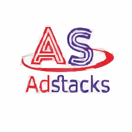

# Adstacks Media Dashboard

<div align="center">
  

  ### Flutter Web Office Dashboard

  [](https://flutter.dev)
  [](https://dart.dev)
  [](https://adstacksmedia-dashboard.web.app)
  []()
  []()

  **Live Demo → [https://adstacksmedia-dashboard.web.app](https://adstacksmedia-dashboard.web.app)**
</div>

---

## Overview

A production-quality Flutter Web office dashboard built for Adstacks Media as part of a Flutter Developer internship assessment. The dashboard is fully responsive across mobile, tablet, and desktop screen sizes, built with clean MVVM architecture, Riverpod state management, and modern Flutter web best practices.

---

## Features

- Fully responsive layout — Mobile, Tablet, Desktop Small, Desktop Large
- Interactive mini calendar with month and year dropdown selectors
- Dual-line performance chart showing project data from 2018 to 2026
- Top Creators table with colored rating bars and responsive column visibility
- Birthday and Anniversary cards with overlapping avatar stacks
- Collapsible sidebar with smooth animation and icon-only collapsed mode
- Hero project card with dark gradient and floating 3D geometric shapes
- Web-native hover states on all interactive elements using `MouseRegion`
- Loading state with circular indicator before data is ready
- Error state with retry button if initialization fails
- Empty state UI for all list sections
- SVG logo rendering for crisp display at all sizes
- Real user avatar with initials fallback

---

## Responsive Breakpoints

| Breakpoint     | Width         | Layout                                                        |
| -------------- | ------------- | ------------------------------------------------------------- |
| Mobile         | 0 – 600px     | Drawer sidebar + Bottom Navigation Bar                        |
| Tablet         | 601 – 900px   | Collapsed sidebar (64px) + Main content                       |
| Desktop Small  | 901 – 1200px  | Full sidebar + Main + Right panel overlay toggle              |
| Desktop Large  | 1201px+       | Full 3-column layout — Sidebar, Main, Right panel             |

---

## Architecture

Classic MVVM with strict layer separation. No business logic in views. No `BuildContext` in ViewModels.

```
lib/
├── models/          Pure Dart data classes, zero Flutter imports
├── viewmodels/      StateNotifier + DashboardState, no BuildContext
├── views/           UI only, ref.watch to read, ref.read to act
├── repository/      Mock data layer, swappable with real API
├── shared/          Reusable widgets used across multiple screens
├── theme/           Design tokens, colors, spacing, typography
├── constants/       App strings, enums, asset paths
├── validators/      Pure static validation methods
├── extensions/      BuildContext, String, Color, DateTime extensions
└── utils/           ResponsiveHelper, DateFormatter, ColorUtils, AppLogger
```

### Layer Rules

| Layer          | Allowed                                     | Forbidden                               |
| -------------- | ------------------------------------------- | --------------------------------------- |
| `models/`      | Pure Dart, Equatable                        | Flutter imports, Color, Widget          |
| `viewmodels/`  | StateNotifier, repository calls             | BuildContext, Widget, Navigator         |
| `views/`       | ref.watch, ref.read, UI composition         | Business logic, repository access       |
| `shared/`      | Presentational widgets, callbacks           | Riverpod, screen-specific logic         |
| `repository/`  | Mock data, model construction               | BuildContext, widgets, state            |

---

## Tech Stack

| Package                | Version  | Purpose                               |
| ---------------------- | -------- | ------------------------------------- |
| `flutter_riverpod`     | 3.3.2    | State management with StateNotifier   |
| `fl_chart`             | 0.68.0   | Dual-line performance chart           |
| `table_calendar`       | 3.1.2    | Interactive mini calendar             |
| `google_fonts`         | 6.2.1    | Inter font family                     |
| `responsive_framework` | 1.4.0    | Breakpoint management                 |
| `flutter_svg`          | 2.0.10   | SVG logo rendering                    |
| `equatable`            | 2.0.5    | Value equality for state classes      |
| `gap`                  | 3.0.1    | Clean spacing widgets                 |
| `intl`                 | 0.19.0   | Date formatting                       |

---

## Project Structure

```
adstacksmedia_dashboard/
├── lib/
│   ├── main.dart
│   ├── app.dart
│   ├── models/
│   │   ├── user_model.dart
│   │   ├── project_model.dart
│   │   ├── creator_model.dart
│   │   ├── performance_data_model.dart
│   │   ├── workspace_model.dart
│   │   ├── nav_item_model.dart
│   │   └── birthday_person_model.dart
│   ├── viewmodels/
│   │   ├── dashboard_state.dart
│   │   ├── dashboard_viewmodel.dart
│   │   └── dashboard_provider.dart
│   ├── views/
│   │   ├── dashboard_screen.dart
│   │   └── widgets/
│   │       ├── sidebar/
│   │       ├── main_content/
│   │       └── right_panel/
│   ├── repository/
│   │   └── dashboard_repository.dart
│   ├── shared/widgets/
│   ├── theme/
│   ├── constants/
│   ├── validators/
│   ├── extensions/
│   └── utils/
├── assets/
│   └── images/
│       ├── logo.svg
│       └── avatar.png
└── web/
    ├── index.html
    └── manifest.json
```

---

## Getting Started

### Prerequisites

- Flutter SDK 3.44.1 or higher
- Dart SDK 3.12.1 or higher
- Chrome browser for web development

### Installation

Clone the repository:

```bash
git clone https://github.com/yourusername/adstacksmedia_dashboard.git
cd adstacksmedia_dashboard
```

Install dependencies:

```bash
flutter pub get
```

Run on Chrome:

```bash
flutter run -d chrome
```

Build for production:

```bash
flutter build web --release
```

---

## Deployment

The project is deployed on Firebase Hosting.

**Live URL → [https://adstacksmedia-dashboard.web.app](https://adstacksmedia-dashboard.web.app)**

To deploy your own version:

```bash
firebase login
firebase init hosting
flutter build web --release
firebase deploy
```

---

## Design Decisions

**Single ViewModel** — All dashboard state lives in one `DashboardState` class with one `StateNotifierProvider`. Simple, clean, and appropriate for a single-screen dashboard.

**Repository pattern** — Mock data lives only in `DashboardRepository`. When a real backend is ready, only this file changes. ViewModels and Views require zero modification.

**Icon mapping in view layer** — `NavItemModel` stores a route enum, not `IconData`. The view layer maps route to `IconData`. This keeps models Flutter-free and unit-testable.

**Color stored as int in models** — `avatarColorHex` stored as ARGB int (e.g. `0xFF4A6CF7`). The view layer wraps with `Color()`. Keeps models pure Dart.

**`responsive_framework` for breakpoints** — Single source of truth for all layout decisions. Breakpoints defined once in `app.dart`, consumed everywhere via `ResponsiveBreakpoints.of(context)`.

**`LayoutBuilder` for widget-level responsiveness** — Individual widgets use `LayoutBuilder` to adapt based on their own available width, not just screen breakpoints. This handles the case where two cards share a row.

---

## Developer

Built by **Ehsan Ali**

Flutter Developer | App Lead at Team Conatus

GitHub → [https://github.com/originehsan](https://github.com/originehsan)